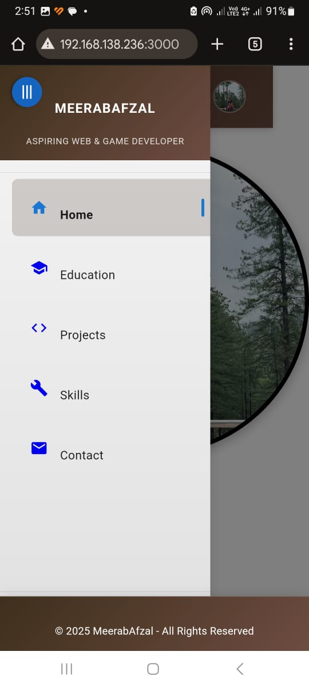
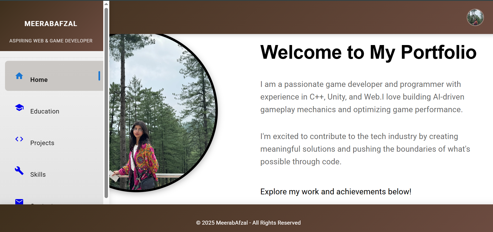
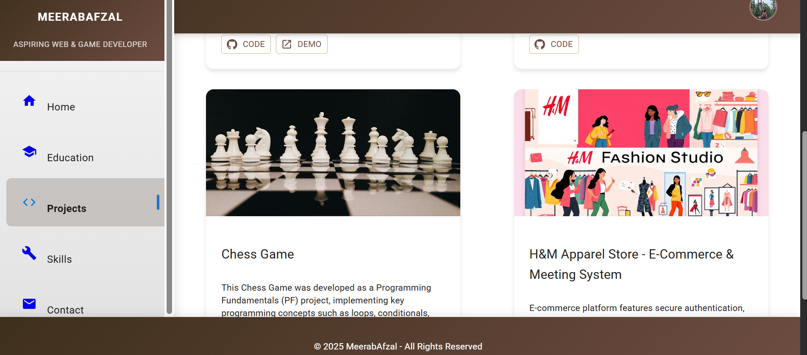
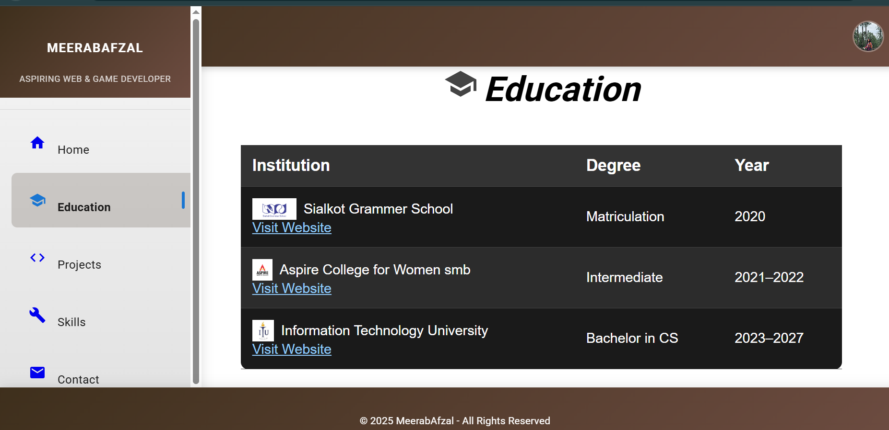
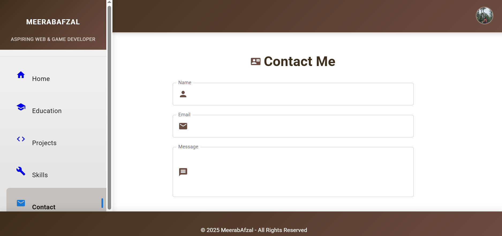
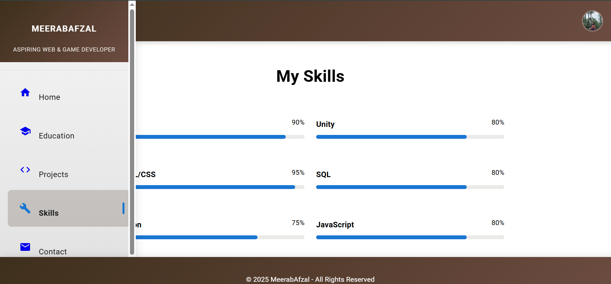

# 🎨 React CSS Portfolio

A modern, mobile-responsive portfolio built using **React 18+**, **Material UI (MUI)**, and **React Router**, following component-based architecture and best practices.

---

## 🚀 Features

### 🔹 Layout
- Sticky AppBar with avatar and menu
- Collapsible side navigation (desktop/mobile)
- Fixed footer
- Dynamic routing

### 💼 Projects
- Animated cards with hover effects
- Tech tags
- GitHub & live links

### 🎓 Education
- Timeline-style layout
- Institutions and years

### 📧 Contact
- Form validation using Yup
- Clean layout and responsiveness

### 💡 Skills
- Responsive skill layout
- Tech icons and hover states

---

## 📱 Mobile Responsive Demo

### Sidebar Open


### Sidebar Closed


---

## 🖼️ Page Previews

### 🏠 Home


### 💼 Projects


### 🎓 Education


### 📧 Contact


### 💡 Skills


---

## ⚙️ Tech Stack

- React 18+
- Material UI
- React Router DOM
- Yup (for validation)
- CSS3 / Flexbox / Grid

---

## 🛠 How to Run Locally

```bash
git clone https://github.com/MeerabAfzal/react-css-portfolio.git
cd react-css-portfolio
npm install
npm start

🌐 Live Demo
🟢 Coming Soon

🙋‍♀️ Author
Meerab Afzal
💻 CS Student | 🎮 Game Developer | 💡 React & Unity Enthusiast

📄 License
Licensed under the MIT License

